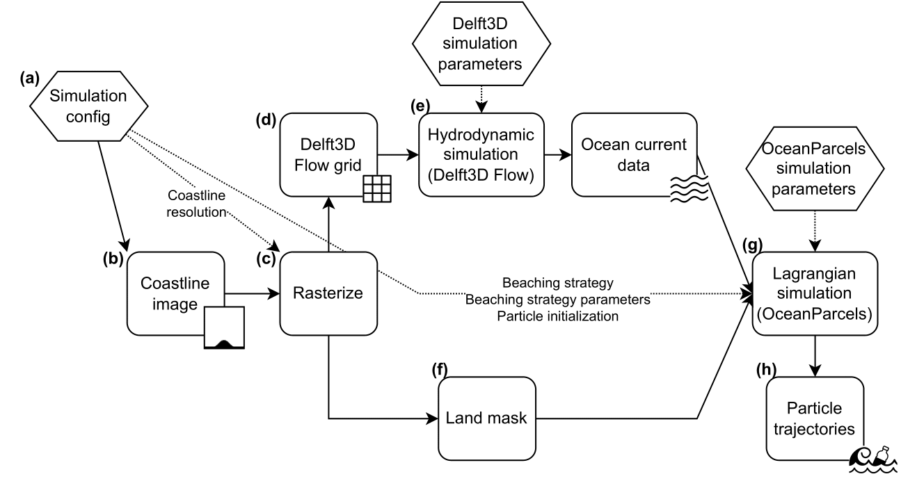

<h1>
"Beaching Strategies and their Effect on the Accumulation of Ocean Plastic within Lagrangian Particle Tracking Simulations" by Nick Hodgskin
</h1>

> This repository acts as the supporting codebase for my honours thesis done as part of the Computer Science honours program at the University of Western Australia during 2022.

<h2>Table of contents</h2>

- [Installation](#installation)
- [Reproducibility of data and visualisations](#reproducibility-of-data-and-visualisations)
- [Steps in the modelling pipeline](#steps-in-the-modelling-pipeline)
  - [(a) Simulation config](#a-simulation-config)
  - [(b) + (c) Coastline image and Rasterize](#b--c-coastline-image-and-rasterize)
  - [(d) Delft3D Flow grid](#d-delft3d-flow-grid)
  - [(e) Hydrodynamic simulation (Delft3D Flow)](#e-hydrodynamic-simulation-delft3d-flow)
  - [(f) Land mask](#f-land-mask)
  - [(g) Lagrangian simulation (OceanParcels)](#g-lagrangian-simulation-oceanparcels)
  - [(h) Particle trajectories](#h-particle-trajectories)
- [Discussion: Personal thoughts regarding the codebase](#discussion-personal-thoughts-regarding-the-codebase)

## Installation
**NOTE**: This environment works best on a non-Windows operating system (Linux, Mac, or using Windows Subsystem for Linux) due to some [documented](https://github.com/OceanParcels/parcels/issues/793), Windows-specific incompatibilities within the OceanParcels codebase.

Assuming Anaconda exists on the system, set up the environment by running:
```bash
conda env create -n parcels_hons_l --file environment.yml
```

This has been tested on WSL, and is (relatively) quick to install. If this doesn't work, `environment_general.yml` provides an installation without pinned dependencies (although dependency resolution for this installation takes a while from my experience).

Then its just a matter of activating the new environment:
```bash
conda activate parcels_hons_l
```
---

In order to run hydrodynamics, it is required to have an installation of Delft3D (which can be done by following their [installation manual](https://content.oss.deltares.nl/delft3d/manuals/Delft3D-Installation_Manual.pdf) or looking at their [getting started](https://oss.deltares.nl/web/delft3d/get-started) page.

## Reproducibility of data and visualisations
For this project there is namely 2 categories of data. The hydrodynamic data generated by Delft3D Flow, and the particle trajectory data generated through OceanParcels. The hydrodynamic (equilibrium snapshot) data is small in size, and is hence included in this codebase (`my_modelling/sim-runs-hydro/*/flow_snapshot.nc`). The particle trajectory data on the other hand is several gigabytes and is not stored here (although is easily produced by running the simulations again with the correct dependencies installed).

This means that the modelling pipeline (detailed below) can be run from part (g) for the existing simulations without having to install Delft3D. It should be as simple as running a script.

## Steps in the modelling pipeline
All the modelling code is stored in the `my_modelling` folder. References to files/folders within the following subsections can be found in the `my_modelling` folder.

The modelling pipeline (as first described in the methodology chapter of the thesis) is described in the following diagram.



### (a) Simulation config
The simulations are defined through toml files stored in `sim-configs`. These configs are created via `config_create.ipynb` (with the help of tooling provided in the `config_create.py` file). These configs store:
- Data required to run the simulations including
  - hydrodynamics:
    - coastline file
    - coastline origin
    - coastline resolution
  - particle simulation:
    - particle simulation parameters
    - particle initialization
    - beaching method
    - beaching parameters
  - **Note that only coastline, resolution, and beaching strategy were varied between simulations
- Semantic names/codes for the simulation
  - To be used in plotting (as well as to relate back to the thesis)
- Keys of 3 words (e.g. magazine-butter-tango) used to uniquely cache models based on their configurations
  - These were computed by hashing the config dictionary, which is then converted into a human readable hash of 3 words.

### (b) + (c) Coastline image and Rasterize
The images for the coastlines (paths of which are specified through the config) are given in `templating/coastlines`. These were manually rasterized, and then loaded in and converted to a boolean array specifying land and ocean cells (done in `hydro_generation.ipynb`).

In this step, `hydro_generation.ipynb` initialises a folder in `sim-runs-hydro` (named with the hydro ID from the config) to run the Delft3D Flow simulation from. It also copies across files from `templating/hydro_template_1km` or `templating/hydro_template_2km`, which specify the Delft3D parameters used in part (e).

### (d) Delft3D Flow grid
Within `hydro_generation.ipynb`, a Delft3D grid file was created using `Delft3D-Toolbox`. This is grid is output to the corresponding hydro simulation folder.

### (e) Hydrodynamic simulation (Delft3D Flow)
Since the `.grd` file was created programmatically, it is missing the corresponding `.enc` file. This must be manually created before proceeding with the simulation.

This can be done by opening the Delft3D GUI, changing in the hydrodynamics directory, navigating to RGFgrid, importing the `.grd` mesh, and exporting it again. This will also create the corresponding `.enc` file.

In addition, depending on the boundaries used for the simulation, the boundaries may need to be redefined.

Now the simulations can be run.

A streamlit app (`hydro_dashboard.py`) was created to explore the flow data from the simulations.

### (f) Land mask
The `hydro_generation.ipynb` file also saves a land mask (`land_mask.nc`) to the hydrodynamics folder to be used later in the Lagrangian simulation.

### (g) Lagrangian simulation (OceanParcels)
The Lagrangian simulation is defined in `particles_modelling.py`. Running this script will take the list of config files, and run all of the simulations (skipping any simulations that already have outputs) on the Delft3D hydrodynamics. Note you may need to `cd` into `my_modelling` to run the script. The code to parse the Delft3D Flow NetCDF dataset is in `delft_to_parcels_tooling.py`. Additional discussion on the inclusion of tooling to parse Delft3D Flow output in the codebase is detailed [here](https://github.com/OceanParcels/parcels/issues/1205).

### (h) Particle trajectories
Finally, the particle trajectories are output. Various methods to process the data are contained within `particles_vis_tooling.py`. These methods are used in `visualisations.ipynb` (the same visualisations used in the body of the thesis).


---

## Discussion: Personal thoughts regarding the codebase
Coming to the end of the project, there are some remarks to be made about potential directions that could have been taken, or features that could have been added in the modelling approach:

- Pythonic way of specifying config files
  - Although I appreciated my customised way of defining models using configs, I feel that the issue using configs to define models (and determining a location to store the cached output) is a common enough problem. I hence wonder whether there is a more Pythonic way to approach this issue (or a package I could use).
- Data versioning
  - As expected, the model outputs are not tracked in Git due to their sheer size. Although data versioning would not have had a significant benefit in this project (as there were no other developers on this project, and there were not many datasets, and I'm only working on one machine), I would in future like to learn to use [DVC](https://dvc.org/) to version and track my data. 
- Programmatic rasterization of images
  - The `.svg` files used to specify the coastlines could have been rasterized directly in the code rather than using the manually rasterized `.png` file. This approach was used in `visualisations.ipynb` to display the coastlines, however could have also been incorporated into `hydro_generation.ipynb` or `hydro_mesh.py`.
  - This is a minor, quick change. In this instance, it doesn't have much impact as only two resolutions are used (hence there is not real downside).
- Programmatic running of hydrodynamics
  - Programmatically interfacing with Delft3D is not well supported within Python. Some packages exist ([Delft3D-Toolbox](https://github.com/Carlisle345748/Delft3D-Toolbox) and [pyDelft3D-FLOW](https://github.com/JulesBlm/pyDelft3D-FLOW)) to generate model files and run simulations, however they aren't actively maintained. Through this project, I used `Delft3D-Toolbox` to generate the grid files. As I only needed to run 4 sets of hydrodynamics, and I didn't need to customise any other variables across simulations, I decided to leave the automation there and run the simulations manually. This was also done because I didn't want to rely too heavily on an uncommon package.
  - Unfortunately I didn't manage to give `pyDelft3D-FLOW` a try during my modelling.

---
Thank you for reading!
